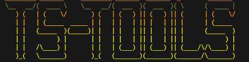

# TSecurity - Important Notice Regarding Tool Installation and Usage

^ATTENTION - Users may encounter complex bugs and intricate issues during the download or installation of TSecurity's tools. These challenges can often be readily resolved through direct support.^

# TSecurity Support Resources

---------------

We understand the importance of readily available assistance. Currently, our dedicated support website is undergoing active development to address underlying code complexities. We anticipate the website will be fully operational within an estimated timeframe of 1 to 3 months.

We sincerely apologize for this extended waiting period and want to assure you that our team is diligently working to expedite its completion. In the interim, should you have any urgent concerns or require immediate assistance, please do not hesitate to contact me or a member of our group privately. Your patience is greatly appreciated as we strive to provide you with the best possible support experience.

# Top Security
______________

Despite the current development phase of our support resources, TSecurity's core strength lies in its robust security architecture and the sophisticated methodologies embedded within its tools. Designed with the insights of leading cybersecurity experts in mind, TSecurity offers a powerful suite of functionalities for in-depth analysis and proactive threat mitigation. We are confident that the advanced capabilities and the meticulous attention to security detail will be of significant interest and value to professionals operating at the forefront of the cybersecurity landscape.

# Discord Group
_________________

### COMING SOON

# Updates
__________

We Up

